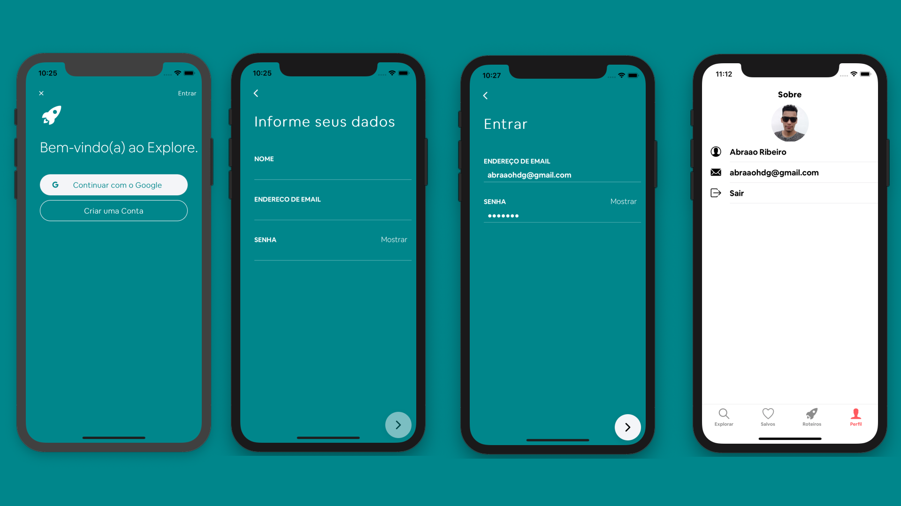
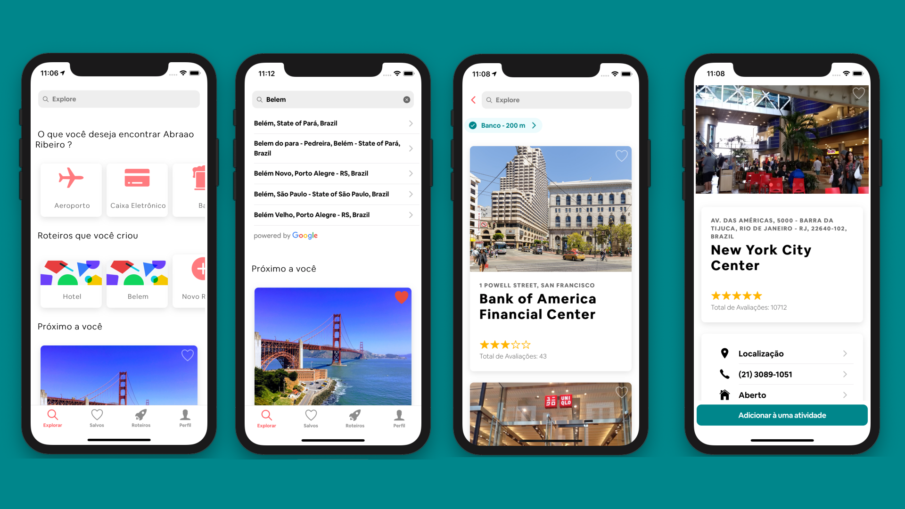
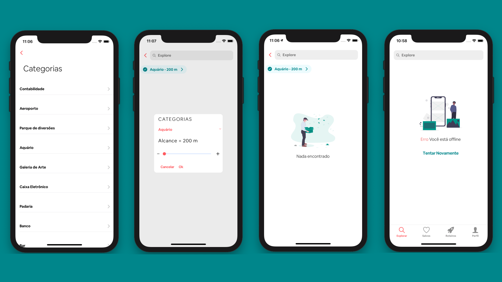
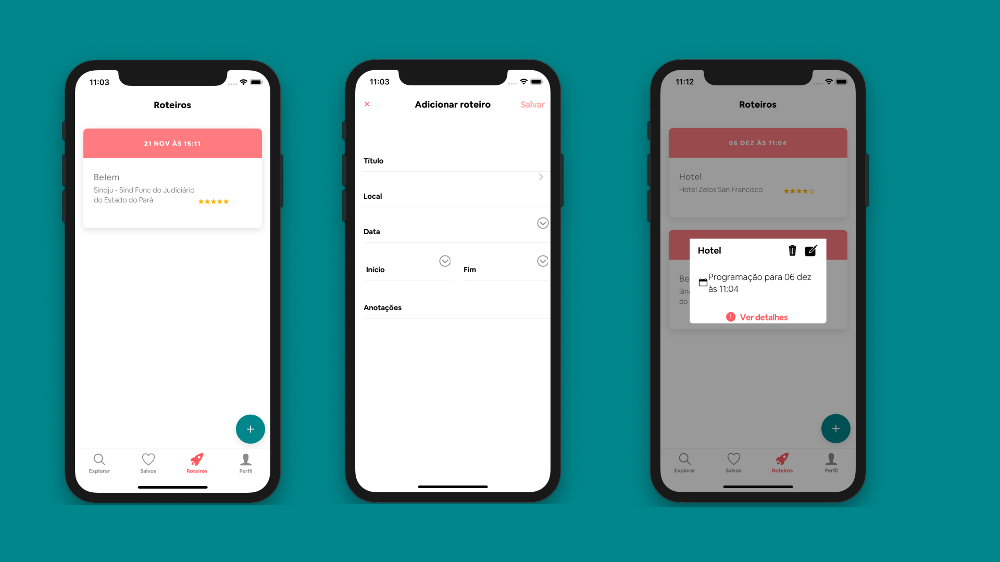

# Explore

# Finalidade 
  Aplicativo para criação de roteiros de passeios. 
# Tecnologias 
- Angular
- Ionic 4
- Firebase Storage 
- Firebase Auth
- GoogleMaps
- GooglePlaces

# Funcionalidades

- Logar com conta de redes socias ou usuario e senha;
- Cadastrar roteiros;
- Cadastrar atividade de um roteiro;
- Listagem de lugares;
- Listagem roteiros;
- Listagem de ativiadade por roteiro;
- Lugares próximo de mim;
- Busca de lugares;
- Listagem de atividades;
- Notificação de tempo de vista;
- Mapa de lugares;
- Notificação quando estiver perto do local da atividade;
- Favoritar um local;
